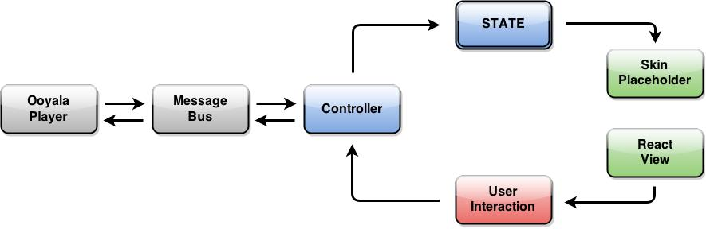

# html5-skin
An open-source HTML5 UI skin based on [ReactJS](https://github.com/facebook/react) that overlays Ooyala core player.

## Requirement
- Ooyala player is a requirement. To know more, visit: [www.ooyala.com](http://www.ooyala.com)
- React JS to render virtual DOM

## Examples
```javascript
<html>
  <head>
    <script src="https://cdnjs.cloudflare.com/ajax/libs/react/0.12.2/react.js"></script>
    <link rel="stylesheet" href="https://maxcdn.bootstrapcdn.com/bootstrap/3.3.2/css/bootstrap.min.css">

    <script language="javascript" src="//player.ooyala.com/v3/6440813504804d76ba35c8c787a4b33c?debug=true&platform=html5"></script>
    <script src="build/html5-skin.js"></script>
  </head>
  <body>
    <div id='container' style='width:640px;height:480px'></div>
    <script>
      var playerParam = { layout:'chromeless' };
      OO.ready(function() {
        window.pp = OO.Player.create('container', 'RmZW4zcDo6KqkTIhn1LnowEZyUYn5Tb2', playerParam);
      });
    </script>
  </body>
</html>
```

We have a sample HTML page ready for you. Check out [sample page](./sample.html)

## Structure and Data Flow
Html5-skin application has 2 major parts: the __controller__ and the __skin-placeholder__ (Modular React Component). The controller serves as a __Message Bus__ bridge between the core player and the UI skin, by publishing and listening the corresponding events from the player. It will then decide necessary components for skin-placeholder to show.



Html5-skin favors single directional information flow. User interaction passes information to controller for event publishing. Controller then listens to events from core player, adjusts skin __state__ and finally decides skin React components to load. Skin state is owned by controller and may not be changed by skin-placeholder.

## Developer help tool
You need [npm](https://www.npmjs.org/) installed on your computer.
From the root project directory run these commands from the command line:

    npm install

This will install all dependencies.

This project also makes use of a git submodule for the config file. This needs to be initialized
using the git submodule commands:

    git submodule init
    git submodule update
    git pull

The init and update should only need to be run once, afterward git pull will
update the submodule as well as the parent repo.

To build the project, first run this command:

    sudo npm install -g gulp

This will install gulp module globally. Then, simply run this command:

    gulp

This will perform an initial build and start a watch that will update build/html5-skin.js with any changes you wish to make in js folder.

If you have the forever module installed, you can use the following command to keep gulp running:

    forever --spinSleepTime 5000 --workingDir <path to your project directory> /usr/local/bin/gulp

Once you've built the Javascript with gulp, you'll need to run a webserver in order to serve sample.html.
The simplest way to do this is with python's built in server, but you can use any server you like.
To start a python server, cd into the repo directory and run:

    python -m SimpleHTTPServer

You should now be able to load the sample page by hitting http://localhost:8000/sample.html

## Publisher and Ooyala Customer
Able to fork git repo and build the skin at will. Terms and condition apply. Please read [Ooyala open-source onboarding guide](http://www.ooyala.com)
